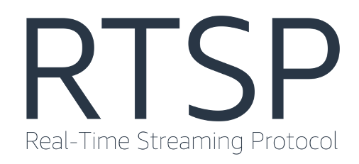

TALLER DE REDES Y SERVICIOS - TALLER

TAREA 2 - 3

> Estudio del comportamiento de RTSP

## Tabla de Contenidos
* [Informacion General](#informacion-general)
* [Tecnologias Usadas](#tecnologias-usadas)

## Informacion general

Esta tarea consiste en el estudio del comportamiento normal de un protocolo en especifico, en nuestro caso RTSP, y estudiar sus respuestas frente a cambios en su trafico cuando se inyectan paquetes no deseados
al mismo tiempo o cuando se modifican sus campos especificos. Todo esto con el fin de estudiar  y analizar como funcionan los parametros y metricas de red.
<!-- You don't have to answer all the questions - just the ones relevant to your project. -->

## Tecnologias usadas
- Wireshark
- VmWare Workstation 17 Player
- FFMpeg
- Bluenviron
- Docker
- Scapy
- pip3

A continuación, se presentan README que contienen archivos que utilizamos para realizar la tarea 2 y 3. Además, todos los codigos utilizados para la tarea 3 se encuentran en el repositorio codigos.md

-https://github.com/bluenviron/mediamtx/blob/main/README.md

-https://github.com/secdev/scapy/blob/master/README.md

-https://github.com/docker

-https://www.vmware.com/products/workstation-player/workstation-player-evaluation.html

<!-- Optional -->
<!-- ## License -->
<!-- This project is open source and available under the [... License](). -->

<!-- You don't have to include all sections - just the one's relevant to your project -->

<!---
blobos1/blobos1 is a ✨ special ✨ repository because its `README.md` (this file) appears on your GitHub profile.
You can click the Preview link to take a look at your changes.
--->
